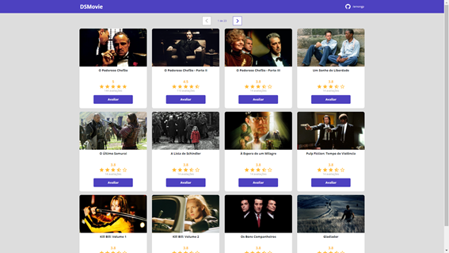
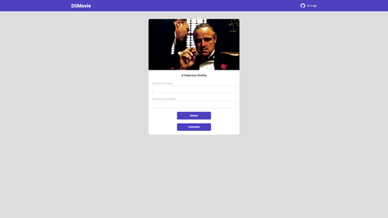

# Projeto DSMovie

Projeto oferecido pela DevSuperior na semana 'spring react 7.0' nivel iniciante, em evento realizado de 7 a 13/03/22 de forma on line.

O projeto consiste em um site estático com 12 cards de filmes, utilizando o Bootstrap para ajuste de responsividade do site.

O site possui botões que direcionam para um formulário de avaliação do filme.

## - Tecnologias utilizadas

- HTML
- CSS
- Git
- Github

## - Imgens do projeto final

- Tela inicial
  
- Tela de avaliação do filme (formulário)
  

Acesse o site: [DSMovie](https://arnongp.github.io/dsmovie/index.html)
